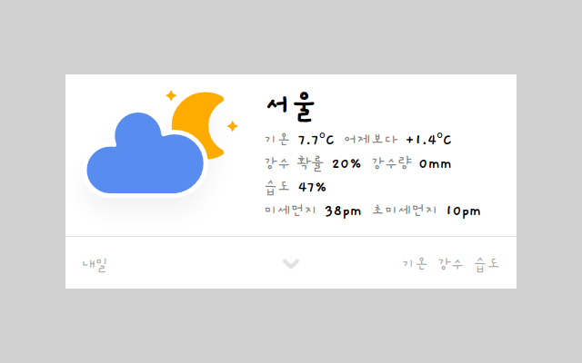
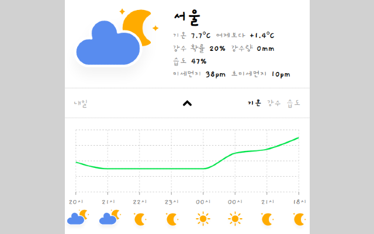
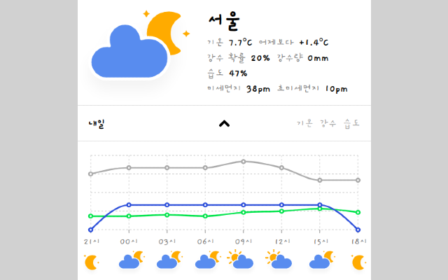

# Raccoon Weather

<a href="https://chrome.google.com/webstore/detail/raccoon-weather/lkjiceiccfaeddfhodmclmicchaagcno" target="_blank">Raccon Weather</a>

<a href="https://github.com/raccoon91/raccoon-weather-server" target="_blank">raccoon-weather-server</a>

### Introduction

- React를 이용한 Chrome Extension
- 사용자의 ip 주소를 이용해 위치를 판별하고 해당 시, 도의 날씨, 예보를 보여주는 크롬 익스텐션

<div style="display: flex;">
  
  
  
</div>

### Features

- WIFI IP 주소를 이용해 사용자의 위치 판별
- redis를 이용한 날씨, IP 데이터 캐싱
- 일정 시간마다 시, 도별 날씨 및 예보 저장
- 그래프를 이용한 시간대별 예보 정보

### Installation

```
git clone https://github.com/raccoon91/raccoon-weather-extension-v2.git

cd raccoon-weather-extension-v2

yarn install

yarn start // localhost:3000
```

### Tech

#### Front

- Typescript
- React, Mobx
- recharts.js
- styled-components

#### Back

- Typescript
- Express.js
- AWS EC2
- Mysql(sequelize), Redis
- node-cron
- Naver Geolocation API
